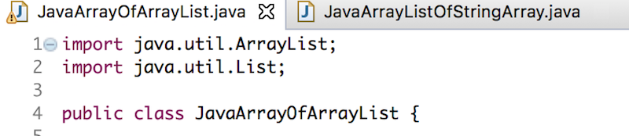

# E como é e como funciona um ArrayList?

Existem vários tipos diferentes de listas

        - map
        - ArrayList
        - List
        - setList

Mas a que vamos utilizar é o ArrayList.

## O que é um ArrayList?

O ArrayList funciona de maneira semelhante a um array normal, mas com uma diferença fundamental: em um array simples, é necessário definir a quantidade de posições antecipadamente, enquanto no ArrayList podemos adicionar infinitas posições sem precisar defini-las previamente. 

## Como funciona e como fazer?

Inicialmente é importante declaramos o nosso ArrayList e importamos as bibliotecas para que o nosso Array funcione de maneira correta.

* Declarando um ArrayList:

        ArrayList<TipoDeDado> NomeDoQueTeráNaLista = new ArrayList<>();
    ou

        List<TipoDeDado> NomeDoQueTeráNaLista = new ArrayList<>();

* Adicionando as importações necessárias:

        import java.util.ArrayList;
        import java.util.List;

As importações precisão ser feitas na primeira linha do nosso arquivo!!

Exemplo: 

### Principais tipos de dados: 
    - Integer
    - Double
    - String
    - Flout

Futuramente veremos que poderemos criar classes que podem também se tornar um tipo de dado.

### Alguns métodos mais usados do ArrayList:

    - NomeDaLista.add(objetoQueQueroAdicionarALista);
    - NomeDaLista.remove(posiçaoDoObjetoNaLista  ou o objeto);
    - NomeDaLista.contains(objetoQueQueroSaberSeTemNaLista);
    - NomeDaLista.clear(); //Remove tudo que tiver na lista
    - NomeDaLista.get(posiçãoDoObjetoQueEuQueroPegar);
    - NomeDaLista.indexOf(DizAPosiçaoDeUmObjExpecifico);  
    - NomeDaLista.size(); //Me diz o tamanho da minha lista
