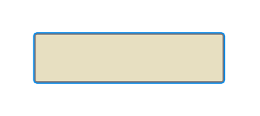
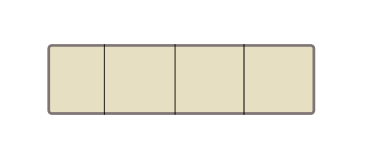
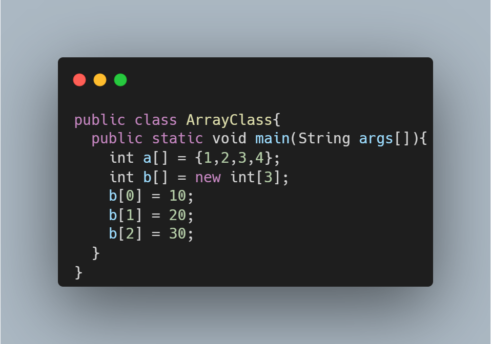

# O que danado é um vetor, pelo amor de Deus?

**Não se desespere, vetor é a coisa mais simples do mundo!!**

Imagine um retângulo....
conseguiu imaginar? 

caso não, aqui vai uma imagem:

Imagine agora que colocamos várias divisórias nesse retângulo:

cada quadradinho chamaremos de **posição**!
Nossas posições serão inumeradas de 1 à N, sendo N, a quantidade de posições que a gente quer que tenha o nosso array.

## Para que serve essas posições?

Cada posição podemos armazenar algum tipo de informação. **Vale ressaltar que em um Array, todos os elementos armazenados precisar ser do mesmo tipo de dado.**

### Principais tipos de dados: 
    - Int
    - Double
    - String
    - Flout

### Exemplo de um Array de números:

No exemplo acima temos as duas formas de declaramos um array.

Na primeira forma:

        int a[] = {1,2,3,4};

Nosso array já possuí todos os seus objetos definidos.

Na Seguenda teremos:

        int b[] = new int[3];

Nesse caso, teremos um array vazio com 3 posições para adicionarmos as informações que quisermos.