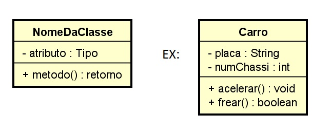

# Como começar um projeto em JSP para fazer a prova de Didi Oliveira

(irei dividir em passos a serem seguidos, por que acredito que assim ficará mais fácil para todos).

## Passo 1 - Exercitando o pensamento

* A primeira coisa que devemos fazer é pensar!

Para isso, é muito mais fácil quando nos perguntamos:
**"O que eu preciso fazer?**

Se eu preciso fazer opções de **Cadastro, Atualizar um cadastro, Ver Quem está cadastrado e Remover algo/alguém específico** (as 4 opções que estamos trabalho) eu vou seguir e fazer apenas isso!

A partir daí começam os trabalho!!

## - Passo 2 - Criando Classes

Após exercitarmos o pensamento, vamos criar nossas classes seguindo a ideia de:
  - **O que precisamos guardar?**
  - **O que são as coisas principais que eu vou precisar manipular?**

  (Lembrem que normalmente Diego sempre põe os diagrama de classes no quadro ou pode ser que venha na prova, então a partir dele vamos criar nossas classes)

**IMPORTANTE LEMBRAR**

Nessas classes eu sempre irei precisar colocar(PEOO):

* **Todos os atributos**
    Declarando um atributo:

        Private tipo Atributo;

    Lembrando que o *tipo* pode ser: int, String, double...

* **Construtor padrão**

        public NomeDaMinhaClasse(){

        }

* **Construtor Parametrizado** 

        public NomeDaMinhaClasse(String atributo1, int Atributo2){

            this.atributo1 = atributo1;
            this.atributo2 = atributo2;
        }

* **Getters e Setters**
    nessa parte, lembrem sempre que o **get**, como o próprio nome já diz, vai ser um método pra pegar alguma coisa.

    ex:

        public tipoDeDadoQueEuPrecisoRetornar getAtributo(){
                return atributo;
        }
     X

        public String getNome(){
            return nome;
        }

    e o **set** ele vai servir pra colocar alguma coisa em uma variável. Como ele sempre vai colocar algo, ele nunca vai ter retorn

    ex: 

        public void setNome(String nome){
            this.nome = nome;
        }

**Exemplo de uma classe com tudo** 

        public class Aluno{

            //Atributos 

            private int idade;
            private String nome;
            private String turma;

            //Construtores

            public Aluno(){

            }
            public Aluno(int idade, String nome, String turma){
                this.idade = idade;
                this.nome = nome;
                this.turma = turma
            }

            //getters e setters

            public int getIdade() {
                return idade;
            }

            public void setIdade(int idade) {
                this.idade = idade;
            }

            public String getNome() {
                return nome;
            }

            public String setNome(String nome) {
                this.nome = nome;
            }
            public String getTurma() {
                return turma;
            }

            public void setTurma(String turma) {
                this.turma = turma;
            }
        }

        LEMBREM DE FECHAR AS CHAVINHAS!!!!

- [Como fazer um ArrayList (uma lista de alguma coisa)](../assuntos/listas.md)

- [Java e HTML](../htmlejava.md)